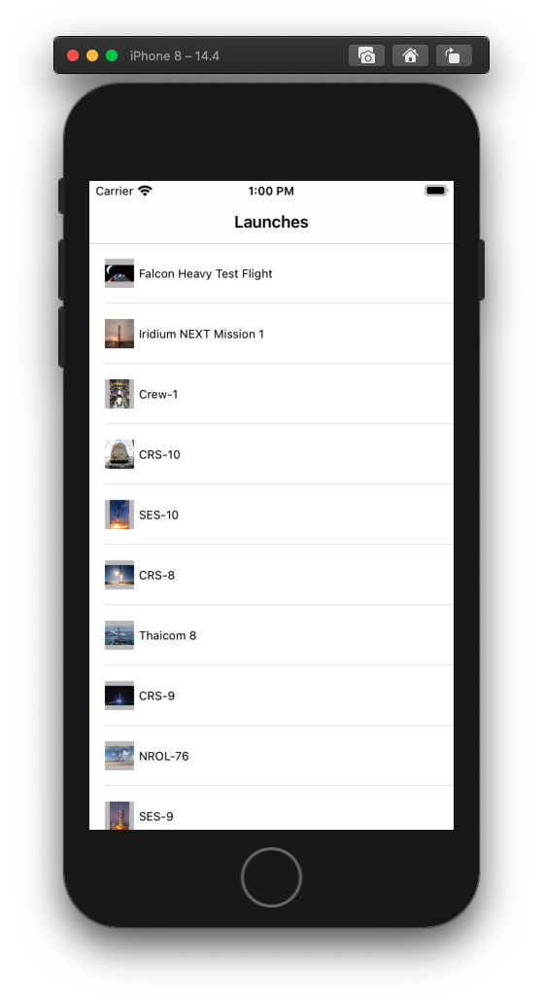
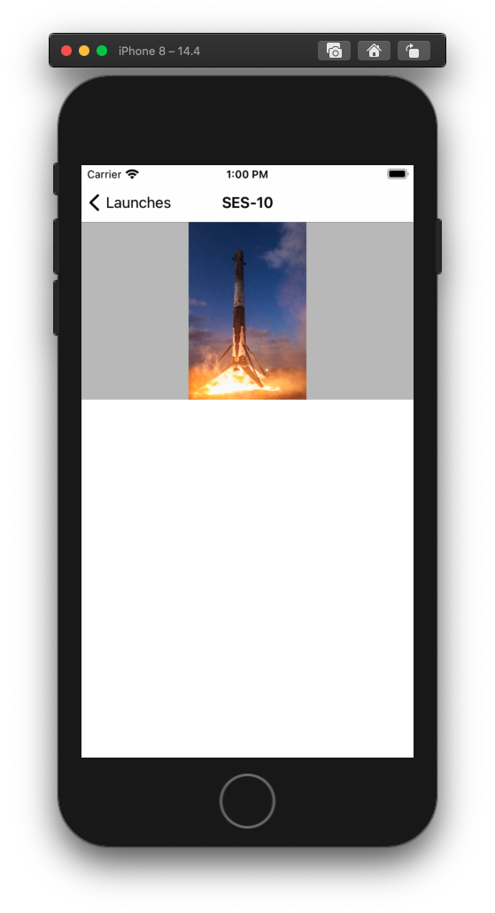

# Svelte-Native Demo App

1. Gets the data from `https://api.spacexdata.com/v3`
1. Caches it in the application documents folder.
1. Displays a list of launches with thumbnails, that can be pulled to refresh.
1. Tapping on an item triggers the navigation to the details screen.

<table>
<tr>
  <td></td>
  <td></td>
</tr>
</table>
